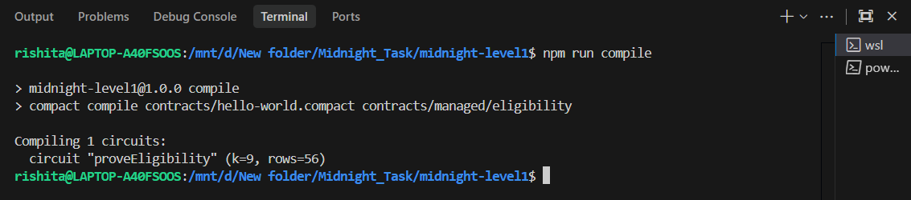
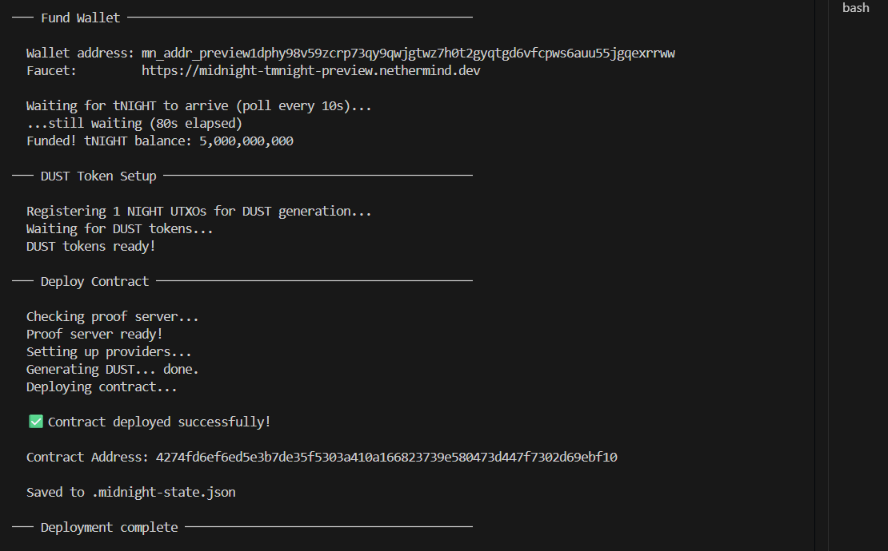

Absolutely. Here is a **complete root `README.md`** designed for the GitHub repository homepage. It makes the Level 1 achievement immediately clear while keeping the detailed implementation inside `midnight-level1/`.

````markdown
# Midnight Builder Challenge — Level 1

<p align="center">
  <strong>Privacy-Preserving Eligibility Proof</strong>
</p>

<p align="center">
  A Midnight Compact smart contract demonstrating how private inputs can be used to prove a public result without revealing the underlying value.
</p>

---

## 🏆 Challenge Progress

| Requirement | Status |
|---|---|
| Midnight Compact toolchain installed | ✅ Complete |
| Compact contract written | ✅ Complete |
| Public ledger state implemented | ✅ Complete |
| Private circuit input implemented | ✅ Complete |
| `disclose()` used deliberately | ✅ Complete |
| Contract compilation successful | ✅ Complete |
| Generated `managed/` artifacts | ✅ Complete |
| Test suite passing | ✅ Complete |
| Midnight Preview deployment | ✅ Complete |
| Deployment screenshot | ✅ Complete |
| Privacy model documented | ✅ Complete |
| Minimum 5 meaningful commits | ✅ Complete |

---

## 📌 Project Overview

This repository contains my implementation for **Midnight Builder Challenge — Level 1**.

The project demonstrates a simple privacy-preserving eligibility verification system using the **Midnight Compact** language.

Instead of revealing a user's private numeric value, the contract allows the user to provide that value as a private circuit input and prove whether it satisfies a predefined threshold.

For example:

```text
Private value:     21
Threshold:         18

Public result:     eligible = true
````

The value `21` remains private.

Only the result of the eligibility check is disclosed.

---

## 🔐 Privacy Model

The core idea of this project is to separate **private inputs** from **public blockchain state**.

### PUBLIC

The following information is stored on the public ledger:

```text
eligible: Boolean
```

Observers can see whether the submitted value satisfies the eligibility requirement.

### PRIVATE

The following information is provided privately to the circuit:

```text
secretValue: Uint<16>
```

The actual value is not disclosed to the blockchain.

### PROOF

The circuit performs:

```text
secretValue >= 18
```

and deliberately discloses only the resulting boolean:

```text
eligible = true
```

Therefore:

```text
Private input
     │
     ▼
┌───────────────────────┐
│  Zero-Knowledge       │
│  Circuit              │
│                       │
│ secretValue >= 18     │
└───────────┬───────────┘
            │
            ▼
     Public result
     eligible = true
```

The important privacy property is that the **result can be public without making the underlying value public**.

---

## ⛓️ Deployed Contract

The contract has been successfully deployed to the **Midnight Preview network**.

| Property         | Value                                                              |
| ---------------- | ------------------------------------------------------------------ |
| Network          | Midnight Preview                                                   |
| Contract         | `proveEligibility`                                                 |
| Contract Address | `4274fd6ef6ed5e3b7de35f5303a410a166823739e580473d447f7302d69ebf10` |
| Compact Compiler | `0.31.1`                                                           |
| Compact Language | `0.23.0`                                                           |
| Compact Runtime  | `0.16.0`                                                           |

### Contract Address

```text
4274fd6ef6ed5e3b7de35f5303a410a166823739e580473d447f7302d69ebf10
```

---

## ⚙️ Compact Circuit

The main circuit is:

```compact
export circuit proveEligibility(secretValue: Uint<16>): [] {
    const threshold: Uint<16> = 18;

    eligible = disclose(secretValue >= threshold);
}
```

The circuit:

1. Accepts `secretValue` as a private input.
2. Compares it against the threshold `18`.
3. Produces a boolean eligibility result.
4. Uses `disclose()` only on the final boolean result.
5. Stores the result in the public `eligible` ledger state.

---

## 🧪 Compilation

The contract compiles successfully using the Compact compiler.

```text
npm run compile

Compiling 1 circuits:
  circuit "proveEligibility" (k=9, rows=56)
```

The generated artifacts include:

```text
contracts/managed/eligibility/
├── compiler/
│   └── contract-info.json
├── contract/
│   ├── index.d.ts
│   ├── index.js
│   └── index.js.map
├── keys/
│   ├── proveEligibility.prover
│   └── proveEligibility.verifier
└── zkir/
    ├── proveEligibility.bzkir
    └── proveEligibility.zkir
```

---

## 🧪 Tests

The project contains tests covering:

### 1. Circuit Logic

Values below the threshold are rejected:

```text
17 >= 18 → false
```

Values meeting the threshold are accepted:

```text
18 >= 18 → true
```

### 2. Public State Transition

The public ledger contains only the eligibility result:

```text
eligible = true
```

### 3. Private Input Protection

The test suite verifies that the private input is represented as a circuit argument while the circuit result exposes no private value.

Run the tests with:

```bash
npm test
```

Expected result:

```text
✔ circuit logic: values below 18 are not eligible
✔ circuit logic: values at or above 18 are eligible
✔ state transition: public state contains only eligibility
✔ private input is not exposed by the generated contract interface

ℹ tests 4
ℹ pass 4
ℹ fail 0
```

> Note: These Level 1 tests validate the circuit logic, state model, and generated contract metadata. They do not replace full zero-knowledge proof execution tests.

---

## 🚀 Running the Project

### Prerequisites

* Node.js 22+
* npm
* Docker Desktop
* WSL2 recommended
* Midnight Compact toolchain
* Git

### Enter the project

```bash
cd midnight-level1
```

### Install dependencies

```bash
npm install
```

### Compile the Compact contract

```bash
npm run compile
```

### Run tests

```bash
npm test
```

### Start the setup/deployment workflow

```bash
npm run setup -- --network preview
```

### Start the interactive CLI

```bash
npm run cli
```

The CLI provides:

```text
1. Prove eligibility privately
2. Read public eligibility result
3. Check wallet balance
4. Exit
```

---

## 🖥️ Project Structure

```text
Midnight_Task/
│
├── README.md
│
└── midnight-level1/
    │
    ├── README.md
    ├── package.json
    ├── package-lock.json
    ├── tsconfig.json
    ├── docker-compose.yml
    │
    ├── contracts/
    │   ├── hello-world.compact
    │   │
    │   └── managed/
    │       └── eligibility/
    │           ├── compiler/
    │           ├── contract/
    │           ├── keys/
    │           └── zkir/
    │
    ├── src/
    │   ├── cli.ts
    │   ├── deploy.ts
    │   ├── network.ts
    │   ├── setup.ts
    │   ├── wallet.ts
    │   ├── wallet-state.ts
    │   └── check-balance.ts
    │
    ├── tests/
    │   └── eligibility.test.ts
    │
    ├── scripts/
    │   ├── clean.mjs
    │   └── e2e-check.ts
    │
    └── screenshots/
        ├── compile-success.png
        └── deployment-success.png
```

---

## 📸 Evidence

### Successful Compilation

The Compact contract was successfully compiled with the `proveEligibility` circuit.



### Successful Deployment

The contract was successfully deployed to the Midnight Preview network.



---

## 💡 Initial Product Idea

### Privacy-Preserving Eligibility Verification

The Level 1 concept can be extended into a privacy-preserving verification platform where users prove that they satisfy eligibility requirements without revealing sensitive personal information.

Possible use cases include:

* Age eligibility
* Student eligibility
* Membership verification
* Access control
* Event participation
* Financial or credit requirements
* Location-independent eligibility checks

For example, instead of submitting an exact date of birth:

```text
Traditional verification:

Date of Birth → 14/03/2004
                    ↓
              Organization
                    ↓
             Age calculated
```

A privacy-preserving approach could instead prove:

```text
Private information
       ↓
Zero-knowledge proof
       ↓
"Eligible: YES"
```

The verifier learns only what is necessary to make the decision.

---

## 🧠 What I Learned

This Level 1 implementation demonstrates the basic architecture of privacy-preserving smart contracts on Midnight:

* Writing circuits with Compact
* Defining public ledger state
* Supplying private circuit inputs
* Using `disclose()` deliberately
* Generating prover and verifier artifacts
* Working with Midnight.js
* Running a local proof server
* Deploying to the Midnight Preview network
* Testing privacy-related contract behavior
* Separating public blockchain state from private witness data

---

## 🛠️ Technology Stack

| Technology       | Purpose                             |
| ---------------- | ----------------------------------- |
| Midnight Compact | Privacy-preserving smart contract   |
| Midnight.js      | Contract interaction and deployment |
| Node.js 22       | JavaScript/TypeScript runtime       |
| TypeScript       | Application and CLI code            |
| Docker           | Local proof server                  |
| WSL2             | Development environment             |
| Git/GitHub       | Version control                     |

---

## 📚 Detailed Level 1 Documentation

The complete Level 1 documentation is available inside the project directory:

**[Open the Midnight Level 1 project](midnight-level1/)**

The project README contains:

* Detailed setup instructions
* Privacy model
* Contract explanation
* Compilation information
* Testing instructions
* Deployment instructions
* Project structure
* Challenge checklist
* Screenshots
* Initial product idea

---

## 🏁 Level 1 Completion Checklist

```text
[x] Toolchain installed
[x] Node.js 22 configured
[x] Docker proof server configured
[x] Compact compiler configured
[x] Privacy-preserving contract written
[x] Public ledger state implemented
[x] Private circuit input implemented
[x] disclose() used deliberately
[x] Contract compiled successfully
[x] managed/ artifacts generated
[x] Tests passing
[x] Contract deployed to Midnight Preview
[x] Contract address documented
[x] Compilation screenshot added
[x] Deployment screenshot added
[x] README documentation completed
[x] 5 meaningful commits created
[x] Project pushed to GitHub
```

---

## 🔗 Repository

**GitHub:**
[https://github.com/Pixie-19/Midnight_Task](https://github.com/Pixie-19/Midnight_Task)

---

## 📄 License

This project was created as part of the **Midnight Builder Challenge — Level 1**.

